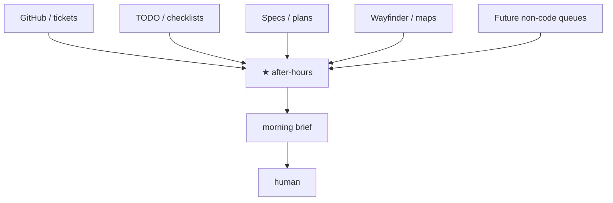

# Composition — after-hours is the AFK loop

**after-hours-loop** is a **workflow-agnostic AFK orchestrator**. It consumes *any* trackable work surface (issues, TODOs, specs, maps, tickets, future non-code queues), runs unattended ticks **A→Z** (executor-defined completion + outcome adapter — not solely “opened a PR”) within safe guardrails, and leaves a morning brief.

Trackers and peer workflows (Matt grill → to-spec → to-tickets, Linear, custom Markdown, …) are **inputs**, not a mandated upstream chain. When peer artifacts exist, we **detect and consume** them as soft context. When they do not, we still run from explicit Sources. Matt remains **soft-compat + opt-in sources** only.

## Mental model

```text
          any tracker / inbox / plan surface
                        │
                        ▼
              ★ after-hours (AFK loop)
           sources → queue → executors → outcomes
                        │
                        ▼
                 morning brief → human
```

Night-time binding is **Sources only** — one orchestrator path; adapters (`sources/*.md`, outcome adapters) extend without forking orchestration.

Optional Mermaid:



## Soft vs hard dependencies

**Hard (must be true before AFK):**

- Queue items are **agent-ready** for *this* domain (clear acceptance; no required HITL mid-tick).
- Runtime basics for the chosen executors / outcome adapters (e.g. `gh` if using `draft-pr`).

**Soft (use if present; never require):**

- Matt-style artifacts: `CONTEXT.md`, `docs/adr/`, `docs/agents/issue-tracker.md`, Agent Brief comments, wayfinder maps / tickets.
- Peer tooling (ponytail, implement, tdd, code-review, domain packs): prefer when installed.
- Any other tracking dialect — add a `sources/*.md` adapter; do not fork the orchestrator.

Vague or decision-heavy items → `blocked` (or skip), never invent scope overnight.

## What AHL never does overnight

- Interactive grilling or answering HITL questions on the user's behalf
- Rewriting domain glossaries / ADRs as product ownership (unless a non-code executor like `docs-digest` explicitly names that path in acceptance)
- Inventing product (or domain) decisions
- Requiring a specific peer workflow (or “upstream chain”) before `/after-hours` can start
- Auto-enabling `wayfinder-afk` / `github-tickets` without an explicit Sources line

Matt present vs absent smoke rows: [smoke-matrix.md](https://github.com/jjheffernan/heff-skills/blob/main/docs/smoke-matrix.md).

## Coexistence

Install Matt skills (or Linear, Notion, custom inboxes, research packs, …) **alongside** heff. After-hours remains the AFK runner:

1. Daytime: whatever workflow produces agent-ready work (optional).
2. Night: **Sources** → `/after-hours` (only night-time binding to a workflow).
3. Morning: brief → human.

See repo [INSTALL.md](../../../INSTALL.md) and [portability.md](../../../docs/portability.md).
